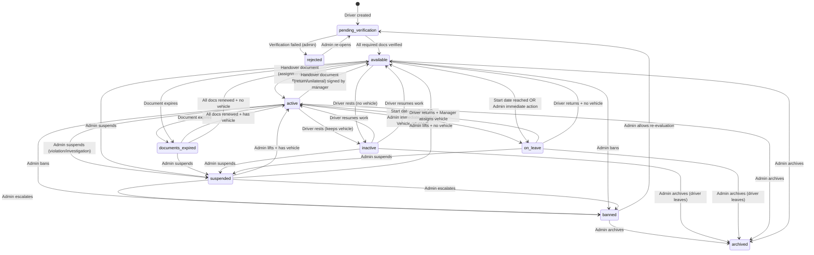

# Driver Status Transition Plan

## Current Statuses (from `Driver.Status` type & `DriverStatus.svelte`)

| Status | Category | Description |
|--------|----------|-------------|
| `pending_verification` | Onboarding | Initial state - documents submitted, awaiting review |
| `rejected` | Onboarding | Failed verification checks |
| `available` | Normal Lifecycle | Verified, waiting for vehicle assignment |
| `active` | Normal Lifecycle | Vehicle assigned, eligible to drive |
| `inactive` | Normal Lifecycle | Short-term pause (e.g., rest for the day). No reason/approval needed. |
| `on_leave` | Normal Lifecycle | Approved extended leave. Requires reason, dates, and vehicle return. |
| `documents_expired` | Compliance | Blocked from driving until renewed |
| `suspended` | Admin Action | Temporary block (investigation, safety incident, policy violation) |
| `banned` | Admin Action | Permanent removal |
| `archived` | Terminal | Account closed, kept for records |

---

## Detailed Transition Matrix

| From | To | Condition | Document / Trigger |
|------|----|-----------|--------------------|
| `pending_verification` | `available` | All required documents verified | Driver verification result |
| `pending_verification` | `rejected` | Verification failed | Admin action |
| `pending_verification` | `active` | **[Not possible]** Must be available first | N/A |
| `rejected` | `pending_verification` | Admin re-opens application | Admin action |
| `rejected` | *Other states* | **[Not possible]** Must go through verification | N/A |
| `available` | `active` | Vehicle assigned to driver | Handover Document (Assignment) |
| `available` | `inactive` | Driver takes a short break | Driver request (auto-approved) |
| `available` | `on_leave` | Scheduled date (`dateFrom`) reached OR Admin immediate override | Leave Record (DB) + Leave PDF |
| `available` | `documents_expired`| One or more required documents expired | System Job |
| `available` | `suspended` | Policy violation, investigation | Admin action |
| `available` | `banned` | Severe violation | Admin action |
| `available` | `archived` | Account closed | Admin action |
| `active` | `available` | Vehicle returned | Handover Document (Return / Unilateral) |
| `active` | `inactive` | Driver takes a short break (keeps vehicle assigned) | Driver request (auto-approved) |
| `active` | `on_leave` | Scheduled date (`dateFrom`) reached OR Admin immediate override | Handover Document (Return) + Leave Record (DB) + Leave PDF |
| `active` | `documents_expired`| Document expired, vehicle must be returned | Handover Document (Forced Return) + System Job |
| `active` | `suspended` | Policy violation, investigation | Admin action + Handover Document (Return) |
| `active` | `banned` | Severe violation | Admin action + Handover Document (Return) |
| `active` | `archived` | Account closed | Admin action + Handover Document (Return) |
| `inactive` | `available` | Driver resumes work (no vehicle was assigned) | Driver request / Auto-resume |
| `inactive` | `active` | Driver resumes work (vehicle remained assigned) | Driver request / Auto-resume |
| `inactive` | `suspended` | Policy violation discovered | Admin action |
| `inactive` | `banned` | Severe violation discovered | Admin action |
| `inactive` | `archived` | Account closed | Admin action |
| `on_leave` | `available` | Leave ends/cancelled (no vehicle assigned) | End date reached / Admin action |
| `on_leave` | `active` | Leave ends/cancelled and immediately assigned a vehicle | Handover Document (Assignment) |
| `on_leave` | `suspended` | Policy violation discovered | Admin action |
| `on_leave` | `banned` | Severe violation discovered | Admin action |
| `on_leave` | `archived` | Account closed | Admin action |
| `documents_expired` | `available` | Documents renewed (no vehicle assigned) | Driver verification result |
| `documents_expired` | `active` | Documents renewed and immediately assigned a vehicle | Driver verification result + Handover Document |
| `documents_expired` | `suspended` | Policy violation discovered | Admin action |
| `documents_expired` | `banned` | Severe violation discovered | Admin action |
| `documents_expired` | `archived` | Account closed | Admin action |
| `suspended` | `available` | Suspension lifted (no vehicle assigned) | Admin action |
| `suspended` | `active` | Suspension lifted and immediately assigned a vehicle | Admin action + Handover Document |
| `suspended` | `banned` | Escalated to permanent ban | Admin action |
| `suspended` | `archived` | Account closed | Admin action |
| `banned` | `archived` | Account closed/record keeping | Admin action |
| `banned` | `pending_verification` | Admin re-evaluates and allows re-application | Admin action |
| `banned` | `available` / `active` | **[Not possible]** Must go through verification | N/A |
| `archived` | *Any* | **[Not possible]** Terminal state | N/A |

---

## State Transition Graph

---

## Transition Criteria & Requirements

### 1. `pending_verification` → `available` (Onboarding Completion)

**Trigger:** All **required** driver requirements verified

**Required Documents (from `driverRequirements` where `required: true`):**
- `drivingLicenseFront` - Prawo jazdy (awers)
- `drivingLicenseBack` - Prawo jazdy (rewers)
- `polishCriminalRecordCertificate` - Zaświadczenie o niekaralności (PL) - *required for PL citizens*
- `foreignCriminalRecordCertificate` - Zaświadczenie o niekaralności (zagranica) - *required for foreigners*
- `medicalCertificate` - Zaświadczenie lekarskie
- `psychologicalCertificate` - Zaświadczenie psychologiczne
- `taxiDriverIdFront` - Legitymacja TAXI (awers)
- `taxiDriverIdBack` - Legitymacja TAXI (rewers)

**Conditional (one of these sets):**
- `idCardFront` + `idCardBack` (Polish citizens)
- `passportMainPage` + `residencePermitFront` + `residencePermitBack` (Non-EU foreigners)
- `passportMainPage` + `idCardFront` + `idCardBack` (EU foreigners)

**Validation:** `verifyDriverRequirements(driver, documents)` returns `true` for all required nodes
**API:** `PATCH /drivers/:id/status` with `{ status: 'available', verificationResult }`

---

### 2. `available` ↔ `active` (Vehicle Assignment/Return)

**Assignment (`available` → `active`):**
- **Trigger:** Manager creates & signs **Handover Document** (type: `assignment`)
- **Document:** `NewHandoverProtocol` component
- **Requirements:** 
  - Vehicle must be in `available` status
  - Vehicle must pass all `vehicleRequirements` for intended service(s)
  - Driver must be in `available` status
- **Result:** `driver.assignedVehicle = vehicleId`, `driver.status = 'active'`, `vehicle.status = 'assigned'`

**Return (`active` → `available`):**
- **Trigger:** Manager creates & signs **Handover Document** (type: `return` or `unilateral`)
- **Types:**
  - `return` - Normal return, both parties sign
  - `unilateral` - One-sided return (e.g., driver abandoned vehicle)
- **Result:** `driver.assignedVehicle = false`, `driver.status = 'available'`, `vehicle.status = 'available'`

---

### 3. `active`/`available` ↔ `inactive`/`on_leave` (Driver-Initiated Pause / Leave)

**Short Break (`active`/`available` ↔ `inactive`):**
- **Trigger (To `inactive`):** Driver requests temporary pause (e.g., done for the day).
- **Requirements:** None. No reason or manager approval required. 
  - If `active`: Vehicle *remains assigned* to the driver. Handover return is NOT required.
- **Result:** `driver.status = 'inactive'`.
- **Trigger (To `active`/`available`):** Driver manually toggles back or auto-resumes next day.
  - Returns to `active` if they kept their vehicle, or `available` if they didn't have one.

**Extended Leave (`active`/`available` ↔ `on_leave`):**
- **The Leave Artifacts:** Every leave requires creating a DB record and generating a PDF document. These must contain: `dateFrom`, `dateEnd`, `approvedBy` (Admin ID), and a `note` (reason).
- **Standard Flow (Scheduled):**
  - **Request:** Driver requests leave, providing a reason and specific dates.
  - **Approval:** Management approves. The DB record and PDF are generated.
  - **Trigger (To `on_leave`):** Status does **not** change immediately upon approval. A scheduled job changes the status to `on_leave` on `dateFrom`.
  - **Requirements:** If the driver is `active`, the vehicle **must be returned** (via Handover Return protocol) on or before `dateFrom`.
- **Admin Immediate Override:**
  - **Trigger (To `on_leave`):** Admin manually places the driver on leave immediately.
  - **Effect:** Implicitly auto-approves the leave, instantly creates the DB record & PDF (with `dateFrom` as today), and changes the status to `on_leave` right away. Vehicle must be returned immediately if `active`.
- **Resume (To `active`/`available`):**
  - **Trigger:** Leave `dateEnd` is reached (handled by scheduled job) OR Admin manually resumes the driver early.
  - **Requirements:**
    - All documents still valid (not expired).
    - Driver transitions to `available`. To become `active` again, a new Handover Assignment protocol must be signed.

---

### 4. Document Expiry Flow (Compliance)

**Monitoring:** Background job checks document expirations daily

**`active`/`available` → `documents_expired`:**
- **Trigger:** Document expires (date passed)
- **Effect:** Driver **blocked from driving** - cannot receive orders
- If `active`: Vehicle must be returned (forced handover return)

**`documents_expired` → `active`/`available`:**
- **Trigger:** All expired documents renewed + verified
- **Requirements:** New documents uploaded, `verifyDriverRequirements()` passes
- **Result:** Status restored based on vehicle assignment

---

### 5. Admin Actions (Suspend/Ban/Archive)

| From | To | Trigger | Notes |
|------|-----|---------|-------|
| Any (except banned/archived) | `suspended` | Admin action: investigation, safety incident, policy violation | Temporary, reversible |
| `suspended` | `active`/`available` | Admin lifts suspension | Restore based on vehicle |
| `suspended` | `banned` | Admin escalates after investigation | Permanent |
| Any (except archived) | `banned` | Admin: severe violations, fraud, safety | Terminal, but can be reset to `pending_verification` |
| `banned` | `pending_verification` | Admin re-evaluates ban | Requires full re-verification |
| Any | `archived` | Admin: driver leaves fleet, account closure | Terminal, read-only |

---

### 6. `pending_verification` ↔ `rejected`

**Rejection (`pending_verification` → `rejected`):**
- **Trigger:** Admin reviews and rejects onboarding
- **Reasons:** Failed background check, invalid documents, duplicate application
- **Effect:** Application closed. Cannot be changed unless Admin intervenes.

**Re-open (`rejected` → `pending_verification`):**
- **Trigger:** Admin manually re-opens the application.
- **Effect:** Driver goes back to the beginning of the onboarding pipeline.

---

## Implementation Checklist

### Backend (Server)
- [x] Add status transition validation in `driver.service.ts`
- [x] Enforce transition rules (e.g., can't go `pending_verification` → `active` directly)
- [x] **Add audit log for each status change** — Implemented via `addVehicleDriverStatusChange()` writing to separate `vehicleDriverStatusChange` collection (`src/lib/server/db/firebase/vehicleDriverStatusChange.fdb.ts`). Captures: `driverId`, `status`, `timestamp`, `userId`, `userName`, `extraData` (reason, handoverId, etc.)
- [x] **Create scheduled job for document expiry monitoring** — Logic implemented in `healthCheck.service.ts` via `checkDriverExpirationDates` (called by `checkFleetProblems`). Returns `HealthIssue[]` with `severity: 'critical'` for expired docs. Scheduling (cron/Cloud Function) pending.
- [ ] **Add webhook/notification for status changes** — Deferred to separate notifications plan

### Frontend (UI)
- [x] Update `DriverVerification.svelte` to show clear progress (already done)
- [x] Add status transition UI in driver detail page (dropdown with valid next states only)
- [ ] **Show handover document modal for `available`↔`active` transitions** — Correctly **absent from `statusTransitions` matrix** (by design). Transitions only occur via handover flow initiated by admin. **Vehicle handover functions complete** in `vehicleStatus.service.ts`: `assignVehicleAndCloseHandover` (tested), `releaseVehicle`, `returnVehicle` — these already update **both vehicle and driver documents atomically** in the transaction (lines 74-75, 117-121, 166-170). **No driver-side functions needed** — drivers can't self-assign/return; admin generates handover document, driver signs, admin closes handover via existing vehicle functions. **Gap**: UI modal to trigger these flows (select handover type, capture signatures, call `assignVehicleAndCloseHandover` / `returnVehicle`).
- [ ] **Add document expiry warnings in driver list/detail** — Partial: `DriverStatusQuickActions.svelte` shows status badge; no proactive warnings (30d/7d/expired banners) in list or detail views.
- [ ] **Admin actions modal for suspend/ban/archive with reason field** — Not implemented. Admin changes status via dropdown directly; no confirmation modal with required reason field.

### Database
- [x] **Ensure `Driver` model has `statusHistory` array for audit trail** — Superseded by separate `vehicleDriverStatusChange` collection (see audit log above). No `statusHistory` array on driver document.
- [ ] **Add indexes for querying by status** — No `firestore.indexes.json` defined. Composite indexes needed for: `status + assignedVehicle`, `status + nationality`, `status + createdAt`.

---

### Driver Status Transition Matrix (from `driver.service.ts:11-66`)

| From \ To | available | active | inactive | on_leave | documents_expired | suspended | banned | archived | rejected | pending_verification |
|-----------|-----------|--------|----------|----------|-------------------|-----------|--------|----------|----------|---------------------|
| **pending_verification** | ✅* | ❌ | ❌ | ❌ | ❌ | ❌ | ❌ | ❌ | ✅ | — |
| **rejected** | ❌ | ❌ | ❌ | ❌ | ❌ | ❌ | ❌ | ❌ | — | ✅ |
| **available** | — | ❌** | ✅ | ❌*** | ❌*** | ✅ | ✅ | ✅ | ❌ | ❌ |
| **active** | ❌** | — | ✅ | ✅ | ❌ | ❌*** | ❌*** | ✅ | ❌ | ❌ |
| **inactive** | ✅ | ❌ | — | ❌ | ❌ | ❌*** | ❌*** | ✅ | ❌ | ❌ |
| **on_leave** | ✅ | ❌ | ❌ | — | ❌ | ❌*** | ❌*** | ✅ | ❌ | ❌ |
| **documents_expired** | ❌*** | ❌ | ❌ | ❌ | — | ❌*** | ❌*** | ✅ | ❌ | ❌ |
| **suspended** | ✅ | ❌ | ❌ | ❌ | ❌ | — | ✅ | ✅ | ❌ | ❌ |
| **banned** | ❌ | ❌ | ❌ | ❌ | ❌ | ❌ | — | ✅ | ❌ | ✅ |
| **archived** | ❌ | ❌ | ❌ | ❌ | ❌ | ❌ | ❌ | — | ❌ | ❌ |

**Legend:**
- ✅ = Direct transition allowed (returns `true`)
- ✅* = Allowed with validation (`extraData.verificationResult` + `validateDriverRequirements()`)
- ❌ = Not in transition matrix (blocked with 400)
- ❌** = **Not in matrix** — requires handover flow (not implemented)
- ❌*** = In matrix but returns `false` (disabled: "currently disabled or not fully implemented")
- — = Same status / N/A

**Key gaps vs. plan:**
1. **`available` ↔ `active` correctly gated by handover** — Vehicle functions (`assignVehicleAndCloseHandover`, `returnVehicle`) handle atomically; UI modal needed to trigger them
2. **Several transitions disabled (`false`)**: `available`→`on_leave`/`documents_expired`, `active`→`suspended`/`banned`, `inactive`→`suspended`/`banned`, `on_leave`→`suspended`/`banned`, `documents_expired`→`available`/`suspended`/`banned`
3. **No handover integration in `driver.service.ts`** — Correct; handover flow lives in `vehicleStatus.service.ts` (vehicle-centric)

---

## Handover Return Flow — Deferred to Separate Plan

The **return handover flow** (`active` → `available` via handover document) is fully specified in this plan (see Transition Matrix row 36, Section 2) but **implementation is deferred** to **`docs/archive/HANDOVER-RETURN-PLAN.md`**.

That plan covers:
- Return handover API endpoint (`/handovers/return/api`)
- UI trigger ("Zwróć pojazd" button) in driver detail page
- `NewHandoverProtocol` modal with `type: 'return'` support
- Camera capture for handover photos (exterior, interior, odometer, damage, equipment)
- Atomic status synchronization: driver `active`→`available` + vehicle `assigned`→`available` + audit logs (`vehicleDriverStatusChange`, `vehicleStatusChange`)
- Validation: direct status changes blocked — only allowed via completed return handover

Once `HANDOVER-RETURN-PLAN.md` is implemented, the `❌**` entries for `available`↔`active` in the transition matrix will become functional via the handover flow (not direct status changes).
